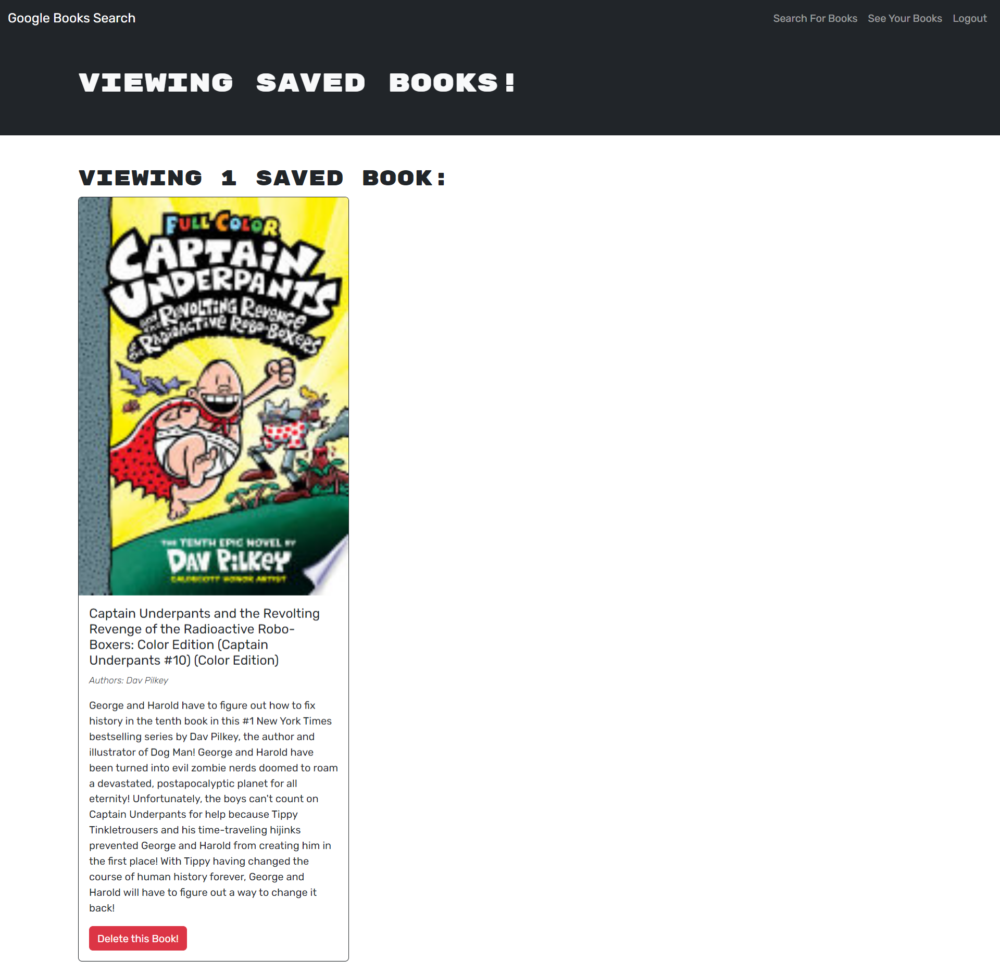

# book-search-engine

## Description

[Book Search Engine](https://powerful-plains-91663-dc3b953e4405.herokuapp.com/)

The Book Search Engine app is a google books API search engine that allows the user to create user accounts and save their favorite books from the google books API to their profile. The purpose of this project is to refactor the application's RESTful API system to use GraphQL with Apollo Server. The app was built using the MERN stack.

## Installation

N/A

## Usage

The user can sign in or sign up for an account and once logged in, they can use the search engine to search Google's Book API and save their favorite books to their account where they can view their saved books at any time. They can also remove any previously saved books from their account dashboard.

## Credits
Instructor led demos, classes, and office hours that helped with developing project